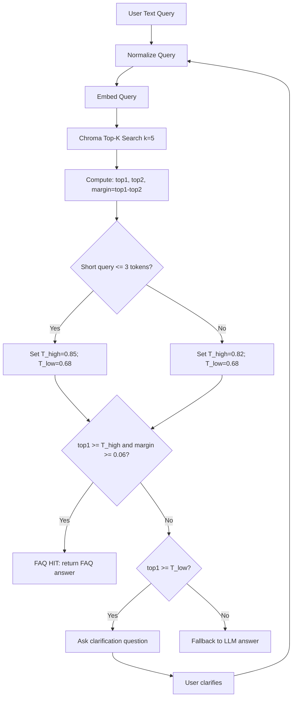

stepsCompleted: [1, 2, 3]

**Facilitator:** Hit
**Date:** 2026-04-12

## Session Overview

ideas_generated: ['Priority questions selected: 1, 3, 4, 6, 11', 'Two-threshold policy with ambiguity band', 'Score margin gating (top1-top2)', 'Short-query stricter threshold', 'Clarification-first behavior in ambiguity zone', 'Latency-aware fallback policy']
**Topic:** End-to-end FAQ retrieval architecture for voice queries, including embedding model selection, Chroma retrieval, threshold logic, hit handling, fallback strategy, latency and production reliability.
**Goals:** Deliver final flow diagram, decision matrix, target precision and latency metrics, implementation plan, test scenarios, and production checklist.

### Session Setup

Scope includes the full retrieval path from text embedding to FAQ answer selection, plus operational concerns (fallback behavior, quality thresholds, and production readiness).
Approach selected: AI-Recommended Techniques.

## Technique Selection

**Approach:** AI-Recommended Techniques
**Analysis Context:** End-to-end FAQ retrieval architecture with focus on measurable quality, latency, and production readiness.

**Recommended Techniques:**

- **Question Storming:** Establishes a complete decision-question inventory before locking implementation details.
- **Morphological Analysis:** Produces a rigorous option matrix across model, retrieval, thresholding, and fallback dimensions.
- **Decision Tree Mapping:** Converts selected options into executable runtime rules and validation branches.

**AI Rationale:** This sequence moves from uncertainty mapping to systematic option evaluation and then to implementation-grade decision logic, matching your requested outputs (diagram, matrix, metrics, plan, tests, checklist).

## Technique Execution Results

### Technique 1: Question Storming (Prioritized)

Selected priority questions:

1. What minimum semantic similarity score should qualify as candidate HIT?
2. Should HIT be gated by both top-1 score and margin (top1-top2)?
3. What confidence is required to bypass fallback?
4. Should short queries use stricter thresholds?
5. When should clarification be asked instead of returning FAQ?

### Technique 2: Morphological Analysis (Decision Matrix)

| Decision Dimension               | Option A               | Option B                | Option C                      | Recommended                 |
| -------------------------------- | ---------------------- | ----------------------- | ----------------------------- | --------------------------- |
| Embedding model                  | text-embedding-3-small | text-embedding-3-large  | bge-small local               | text-embedding-3-large      |
| Similarity metric                | cosine                 | dot product             | euclidean                     | cosine                      |
| Retrieval depth (top-k)          | 3                      | 5                       | 8                             | 5                           |
| Candidate HIT threshold `T_high` | 0.78                   | 0.82                    | 0.86                          | 0.82                        |
| Ambiguity threshold `T_low`      | 0.62                   | 0.68                    | 0.72                          | 0.68                        |
| Margin gate `delta = top1-top2`  | 0.03                   | 0.06                    | 0.10                          | 0.06                        |
| Short-query policy (<=3 tokens)  | no change              | `+0.03` to `T_high`     | `+0.05` to `T_high`           | `+0.03`                     |
| Clarification policy             | never                  | only ambiguity band     | ambiguity band + low margin   | ambiguity band + low margin |
| Fallback policy                  | direct LLM fallback    | clarify then fallback   | retry retrieval then fallback | clarify then fallback       |
| Latency guard                    | none                   | cap at 300 ms retrieval | cap at 250 ms retrieval       | cap at 300 ms retrieval     |

Recommended runtime profile:

- Use top-k=5 with cosine similarity
- HIT when `top1 >= 0.82` and `top1-top2 >= 0.06`
- Ambiguous when `0.68 <= top1 < 0.82` or margin `< 0.06`
- For short queries (<=3 tokens), use `T_high = 0.85`
- Clarify in ambiguous cases, otherwise fallback

### Technique 3: Decision Tree Mapping (Final Flow Diagram)

## Target Metrics (Precision and Latency)

Launch targets:

- HIT precision@1: >= 0.92
- Ambiguity-band clarify acceptance: >= 0.75
- False-positive HIT rate: <= 0.05
- End-to-end p50 latency: <= 900 ms
- End-to-end p95 latency: <= 1800 ms
- Retrieval stage p95 latency: <= 300 ms
- Clarification loop completion rate: >= 0.65

Alert thresholds:

- HIT precision@1 < 0.88 for 24h
- Retrieval p95 > 400 ms for 15 min
- Fallback rate > 35% sustained for 1h

## Implementation Plan

Phase 1: Instrumentation and Baseline

1. Log top1, top2, margin, query length, decision path.
2. Add offline evaluation harness from labeled FAQ pairs.
3. Build precision/latency dashboard.

Phase 2: Decision Logic

1. Implement two-threshold classifier (`T_high`, `T_low`).
2. Add margin gate (`top1-top2`).
3. Add short-query threshold bump.

Phase 3: Clarification and Fallback

1. Add clarification prompt template using top-2 candidates.
2. Route unresolved clarifications to LLM fallback.
3. Add retry guard to avoid clarification loops.

Phase 4: Hardening

1. Add latency timeout and circuit breaker for vector query.
2. Add config-driven thresholds for A/B and hot tuning.
3. Add monitoring alerts and rollback toggle.

## Test Scenarios

Core functional tests:

1. High-confidence paraphrase -> HIT path.
2. Similar intents with close scores -> clarify path.
3. Out-of-domain query -> fallback path.
4. Short ambiguous query (`"refund?"`) -> stricter threshold behavior.
5. Low margin despite high top1 -> no direct HIT.

Quality tests:

1. Offline precision@1 on gold FAQ set.
2. False-positive rate on adversarial paraphrases.
3. Clarification resolution success rate.

Performance and resilience tests:

1. Retrieval p95 under concurrent load.
2. Timeout path when Chroma is delayed.
3. Graceful degradation when embedding API is unavailable.

## Production Checklist

1. Thresholds (`T_high`, `T_low`, margin) externalized in config.
2. Decision-path telemetry enabled and sampled safely.
3. Gold evaluation set updated and versioned.
4. Dashboard for precision, fallback, latency, and clarification rates.
5. Alerting + on-call runbook for precision/latency regressions.
6. Kill switch to force fallback-only mode.
7. Canary rollout with shadow evaluation.
8. Weekly threshold recalibration review.

### Creative Facilitation Narrative

The session converged quickly after prioritizing five high-leverage uncertainty questions. By translating those into a strict morphology matrix and then a runtime decision tree, the brainstorming shifted from abstract architecture discussion to measurable operational policy. The strongest breakthrough was introducing a dual gate (absolute similarity plus score margin) and a short-query adjustment to reduce false-positive FAQ hits while preserving latency goals.
